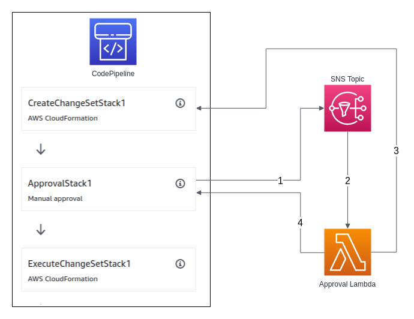

# AWS: Auto-approve CodePipeline with Lambda

Sample repository for setting up a CodePipeline that uses CloudFormation
actions to create/execute change sets with manual approval that is
automatically approved by a Lambda if the change set does not contain
any changes.

## Use case

Are your application and infrastructure split up into different
CloudFormation stacks? Do you want **one** central place to view
deployment status with CodePipeline? Deploying all stacks in the same
CodePipeline gives you that. Perhaps you want to be a little more
careful with certain deploys and have a manual approval step for certain
stacks (such as your network or database infrastructure)?

Consider the following flow:

`Network Stack (requires manual approval) -> Database stack (requires
manual approval) -> Application stack`

Setting this flow up in CodePipeline with manual approvals will force
you to approve the stacks for each revision, even if there are no
changes to said stacks. If you only made a change to the application you
would probably want that change to go through the pipeline without
having to approve empty change sets of the earlier stages.

This repository shows a sample of how to use a Lambda function to
automatically approve a CloudFormation action if there are no changes to
be made to the stack.


## How it works

This sample utilizes that CodePipeline can notify a SNS Topic whenever a
manual approval action is triggered. A Lambda function is subscribed to
this topic and uses the CodePipeline API to check the status of a
certain action (the create change set action). Depending on the status,
the Lambda function then either approves or ignores the manual approval
action.



1. The manual approval action sends a notification to a specified SNS Topic
   with the following custom data:

   ```
   ActionToCheck=CreateChangeSetStack1
   ```

2. The SNS Topic triggers a Lambda function which receives the following
   event data:

   ```
   {
       "region": "eu-west-1",
       "consoleLink": "https://console.aws.amazon.com/codepipeline/home?region=REGION#/view/PIPELINE_NAME",
       "approval": {
         "pipelineName": "PIPELINE_NAME",
         "stageName": "STAGE_NAME",
         "actionName": "ApprovalStack1",
         "token": "12345678-abcd-1234-fghi-123456789abc",
         "expires": "2019-08-29T08:48Z",
         "externalEntityLink": null,
         "approvalReviewLink": "https://console.aws.amazon.com/codepipeline/home?region=REGION#/view/PIPELINE_NAME/Deploy/Approval/approve/12345678-abcd-1234-fghi-123456789abc",
         "customData": "ActionToCheck=CreateChangeSetStack1"
       }
   }
    ```

3. The Lambda function then queries the CodePipeline `GetPipelineState`
   API to get information about the current state:

   ```
   {
        "pipelineName": "PipelineTest",
        "pipelineVersion": 1,
        "stageStates": [
            {
                "stageName": "Source",
                ...
            },
            {
                "stageName": "STAGE_NAME",
                "inboundTransitionState": ...,
                "actionStates": [
                    {
                        "actionName": "CreateChangeSetStack1",
                        "latestExecution": {
                            "status": "Succeeded",
                            "summary": "Change set CHANGESET_NAME was created with no changes.",
                            "lastStatusChange": 1566463705.87,
                            "externalExecutionId": "",
                            "externalExecutionUrl": ""
                        },
                        "entityUrl": "https://eu-west-1.console.aws.amazon.com/cloudformation/home?/"
                    },
                    {
                        "actionName": "ApprovalStack1",
                        "latestExecution": {
                            "status": "InProgress",
                            "token": "12345678-abcd-1234-fghi-123456789abc"
                        }
                    },
                    {
                        "actionName": "ExecuteChangeSetStack1",
                        "entityUrl": "https://eu-west-1.console.aws.amazon.com/cloudformation/home?/"
                    }
                ],
                "latestExecution": {
                    "pipelineExecutionId": "PIPELINE_EXECUTION_ID",
                    "status": "InProgress"
                }
            }
        ],
        "created": 1566373619.963,
        "updated": 1566392450.286
    }
   ```

   The Lambda function uses data from the event to find the correct
   action to verify. From the event it gets `approval.stageName=STAGE_NAME`
   and `approval.customData="ActionToCheck=CreateChangeSetStack1"`.

   The function verifies that the action `CreateChangeSetStack1` in
   stage `STAGE_NAME` has `status=Succeeded` and checks the `summary` field
   which will contain one of the below strings (if the action was
   successful):

   - `Change set CHANGESET_NAME was created.`
   - `Change set CHANGESET_NAME was created with no changes.`

   The function also validates that the token it received matches the
   token in the API response.

4. The function uses the CodePipeline `PutApprovalResult` API to approve
   the action using the token it received in the event if the following
   are all true:
   - The `ActionToCheck` has `status=Succeeded`
   - The `ActionToCheck` has a `summary` that ends with `created with no
     changes.`
   - The token in the event matches the token in the response

## Setup

### 1. Deploy CodePipeline
*Requires the
[AWS CLI](https://aws.amazon.com/cli/)*

```bash
aws cloudformation deploy --template-file cloudformation.yaml --stack-name PIPELINE_NAME --capabilities CAPABILITY_NAMED_IAM
```

The `cloudformation.yaml` in this repository can be used to create a
sample CodePipeline and all required resources. It creates:

- An S3 Bucket to hold CodePipeline artifacts
- An S3 Bucket to source files for the Source stage
- An SNS Topic used by the manual approval action
- A role and policy used by the CodePipeline
- A role and policy used by the CloudFormation actions
- The CodePipeline itself

*Usually, a CloudWatch event would be set up to automatically trigger the
CodePipeline whenever a source file changes in S3. I have left
that part out to keep the CloudFormation template as short and succinct
as possible.*

The Pipeline contains two stages, `Source` and `Deploy`. The `Source`
stage uses a `templates.zip` file in the `PipelineSourceBucket` as a
source for the deploy actions. The zip file should include two files:
`stack1.yaml` and `stack2.yaml`. The `Deploy` stage contains 6 actions,
which when finished will have created two additional CloudFormation
stacks.

### 2. Fetch required outputs

For the coming steps we need to get the ARN of the created SNS Topic and Source bucket.

```bash
$ aws cloudformation describe-stacks --stack-name PIPELINE_NAME --query "Stacks[0].Outputs"

[
    {
        "OutputKey": "PipelineArn",
        "OutputValue": "arn:aws:codepipeline:eu-west-1:000000000000:PipelineTest"
    },
    {
        "OutputKey": "PipelineTopic",
        "OutputValue": "arn:aws:sns:eu-west-1:000000000000:PipelineTestTopic"
    }
]
```


### 3. Deploy Lambda function

*Requires the
[AWS SAM CLI](https://docs.aws.amazon.com/serverless-application-model/latest/developerguide/serverless-sam-cli-install.html)*

1. Make sure you have a bucket that you can use for uploading SAM
   packages.

1. Take note of your **Pipeline SNS Topic ARN** from step 2.

1. Change directory to `lambda`.
    ```bash
    $ cd lambda
    ```

1. Build SAM package

    ```
    $ sam build --use-container -m requirements/requirements.txt
    ```

1. Upload SAM package

    ```
    $ sam package --s3-bucket YOUR_SAM_PACKAGES_BUCKET --output-template packaged.yaml
    ```

1. Deploy SAM package

    ```
    $ sam deploy \
        --template-file packaged.yaml \
        --region YOUR_REGION \
        --capabilities CAPABILITY_IAM \
        --stack-name PipelineApprovalLambda \
        --parameter-overrides "PipelineTopicARN=YOUR_PIPELINE_SNS_TOPIC_ARN"
    ```

## 4. Upload source templates

To be able to start the pipeline you need to upload a file named `templates.zip` to the Source Bucket (check step 2
 for bucket name). This zip file should include two files, `stack1.yaml` and `stack2.yaml` at the **root** level
 . This repository contains two files in the `templates/` directory that you can use. To zip them up correctly use the
  following command:
  
```shell
$ zip -r -j templates.zip ./templates
```

Upload them to S3:

```shell
$ aws s3 cp templates.zip s3://BUCKET_NAME_FROM_STEP_2/templates.zip
```

## 5. Try it out

After setting everything up you can now play around with your
CodePipeline.

1. Go to your newly created pipeline in AWS Console.

1. Click on **Release Change**.

1. If everything works correctly the pipeline should start and then get stuck on the first manual approval step
. Approve the action and then do the same for the second approval action.

1. After the pipeline has succeeded, go to the CloudFormation console page. You should see two new stacks.

1. Go back to the CodePipeline console page and click **Release Change** again (without uploading a new `templates.zip
`). This time the manual approval steps should be automatically approved by your Lambda function. You should be able to 
see the following in the logs of  your Lambda function:
  
    ```
    The change set was created without any changes. Automatically approving approval request.
    ```
   
    If you click on **details** on one of the approval steps, you should see the comment **Automatically approved by
     Lamba.**
   
1. Make a small change to `stack1.yaml`, such as changing the logical name of the Bucket. Zip the files and upload
 them to your Source Bucket.
 
1. Start the pipeline again. The pipeline should now get stuch on the first approval action and you should see the
 following in the Lambda logs:
  
    ```
    There seems to be changes in the change set. Skipping automatic approval.
    ```
   
1. You now have a CodePipeline suitable for multiple stacks that will automatically continue on to the next stack if
 the current stack doesn't include any changes.